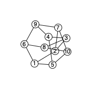

# SimpleTensorNetwork

## Example 1: Spin-glass partition function
This example computes the partition function of an anti-ferromagnetic Ising model on the Petersen graph. The Petersen graph is a graph with 10 vertices and 15 edges.
```julia
edgs = [(1, 2), (1, 5), (1, 6), (2, 3),
(2, 7), (3, 4), (3, 8), (4, 5),
(4, 9), (5, 10), (6, 8), (6, 9),
(7, 9), (7, 10), (8, 10)]
```


The energy model is given by the Hamiltonian
```math
H(\boldsymbol{\sigma}) = -\sum_{(i,j) \in E} J_{ij} \sigma_i \sigma_j
```
where the coupling constants are given by the adjacency matrix of the Petersen graph.

The partition function is given by
```math
Z = \sum_{\boldsymbol{\sigma}} \exp(-\beta H(\boldsymbol{\sigma}))
```
where the sum is over all possible spin configurations.

## Example 2

| **Random variable**  | **Meaning**                     |
|        :---:         | :---                            |
|        A         | Recent trip to Asia             |
|        T         | Patient has tuberculosis        |
|        S         | Patient is a smoker             |
|        L         | Patient has lung cancer         |
|        B         | Patient has bronchitis          |
|        E         | Patient hast T and/or L |
|        X         | Chest X-Ray is positive         |
|        D         | Patient has dyspnoea            |
